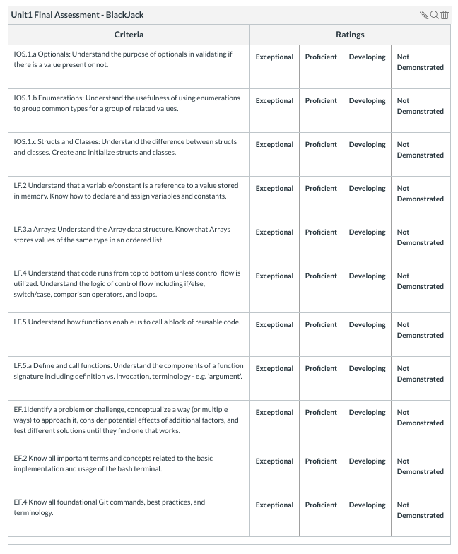

# Unit 1 Assessment - BlackJack command-line macOS application

## Github Instructions 

1. Fork this repo
1. Clone your Fork 
1. Complete the requirements in Xcode 
1. Commit often
1. Open a pull request 
1. Submit a link of your Fork to Canvas

## App Description

In this assessment, your task will be to build a BlackJack command-line app. The MVP (minimal viable product, basic requirements) of this project will be a one-player game against the computer. 

You are free to use Google, StackOverflow, your notes in working through this assessment. Best of luck, address each problem as a sub-task and keep chipping away. You all got this! 

#### Project Overview

#### Card.swift

In keeping with object-oriented programming in our BlackJack game a card will be the main data of the game. 

* The Card has 4 instance properties ```suit```, ```value```, ```isFaceCard``` and ```face```
  * ```suit``` is a diamond, heart, spade or club 
  * ```value``` represents the score value of a card 2 - 10 represent their face value, jack, queen, and king's value is 10. Ace can be 1 or 11. 
  * ```isFaceCard``` is used in the creation of the cards array 
  * ```face``` is an optional FaceCard again only used during the creation of the cards in the newDeck() method 
* The Card has a type method ```newDeck(:_)``` that returns an array of 52 cards [Card]. Since an Ace card can have a value of 1 or 11 you can decide by passing in 1 or 11 as an argument when calling newDeck()
* The stringyfy() method returns a String representation of the current card instance. e.g "10♣️" or "4♦️"

#### Suit.swift

1. Create a new Swift file called Suit, create an enum of the same name that has a diamond, heart, spade and club case. 
1. Make the raw value a String. 
1. Assign the diamond case "♦️", heart case "♥️", spade "♠️" and club "♣️"
1. Make sure your enum conforms to CaseIterable in order for the newDeck() method to work.

#### FaceCard.swift

1. Create a new Swift file called FaceCard, create an enum of the same name that has a jack, queen and king case. 
1. Make the raw value a String. 
1. Assign the jack case "🎃", queen case "👸" and king "🤴"
1. Make sure your enum conforms to CaseIterable in order for the newDeck() method to work.


#### Player.swift

1. Create a new Swift file called Player, create a struct of the same name.
1. Add the following properties ```score``` of type Int, ```cards``` array of type [Card] and ```playerName``` of type String. 

#### Game.swift

Create a new Swift file called Game, create a class of the same name.

The Game object has the following instance properties: 
* ```deck``` is an array of [Card]
* ```player``` is a Player 
* ```hitPlayer```is a Bool 

The Game object has the following computed properties: 
* ```hasMoreCards``` returns a Bool 
* ```randomComputerScore``` returns an Int

The Game object has the following methods: 
* ```newGame()``` resets the game 
* ```stopHits()``` called if the user wishes to pass their turn. In that case the computer draws a random number and a winner is chosen between the computer's score and the player's score. 
* ```hitMe()``` called as the user requests more cards from the deck
* ```computerVsPlayer()``` draws a random number for the computer and determines the winner of the game.
* ```gameStatus()``` takes in the player's card and determines the current score. Here the player score options can be, BlackJack, Bust or Continue playing as their status is still valid for game play.

#### main.swift

1. Create an instance of the Game() 
2. Call newGame on the newly created instance above. 
3. Create a gameOver instance and set it to ```false```. This will be used in your ```repeat-while``` to determine if game play should stop. 
4. Use a ```repeat-while``` to allow the user options between getting new cards by calling the hitMe() method or passing by calling the stopHits() method. 
5. When the player has won or lost ask them if they would wish to continue playing another round.

## MVP Gif

   


## Rubric 




## Bonus Gif 

#### Refactor your app so it is a two player game.


